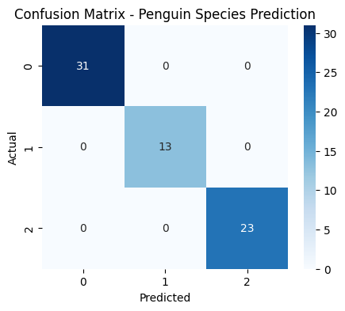

# 🐧 Penguin Species Prediction using Logistic Regression

A simple and effective Machine Learning project that predicts the **species of penguins** based on their physical measurements using **Logistic Regression**.  
Built using Python, Pandas, Scikit-learn, and Seaborn datasets.

---

## 🧠 Overview

This project demonstrates a **multiclass classification** approach using Logistic Regression on the **Palmer Penguins dataset** (available in Seaborn).  
It predicts one of three penguin species:
- **Adelie**
- **Chinstrap**
- **Gentoo**

The dataset is an excellent alternative to the classic Iris dataset — modern, diverse, and visually interpretable.

---

## 📊 Dataset Information

**Source:** Seaborn built-in `penguins` dataset  
**Shape:** 344 rows × 7 columns  

| Column | Description |
|---------|-------------|
| species | Penguin species (Adelie, Chinstrap, Gentoo) |
| island | Island name (Torgersen, Dream, Biscoe) |
| bill_length_mm | Length of bill (mm) |
| bill_depth_mm | Depth of bill (mm) |
| flipper_length_mm | Length of flipper (mm) |
| body_mass_g | Body mass (g) |
| sex | Male / Female |

---

## 🧹 Data Preprocessing
- Handled missing values (dropped rows with `NaN`)
- Label-encoded categorical columns (`island`, `sex`, `species`)
- Standardized numeric features using `StandardScaler()`
- Split dataset into **80% train / 20% test**

---

## ⚙️ Model Details
- **Algorithm:** Logistic Regression (Multiclass)
- **Library:** Scikit-learn
- **Target:** `species`
- **Input Features:**  
  `island`, `bill_length_mm`, `bill_depth_mm`, `flipper_length_mm`, `body_mass_g`, `sex`

---

## 🚀 Training & Evaluation

| Metric | Score |
|---------|--------|
| Accuracy | **100%** |
| Precision | 1.00 |
| Recall | 1.00 |
| F1-score | 1.00 |

✅ The model perfectly classifies penguin species.

---

## 🧩 Sample Prediction

**Input:**
| Feature | Value |
|----------|--------|
| island | Torgersen |
| bill_length_mm | 45.1 |
| bill_depth_mm | 17.2 |
| flipper_length_mm | 210 |
| body_mass_g | 4800 |
| sex | Male |

**Output:**
> 🐧 Predicted Species: **Adelie**

---

## 📈 Confusion Matrix

Here’s the confusion matrix representing true vs. predicted species:



All diagonal entries represent correct predictions — no misclassifications occurred.

---

## 🧰 Requirements

To run this project, install the following Python libraries:

```bash
pandas
numpy
seaborn
matplotlib
scikit-learn

